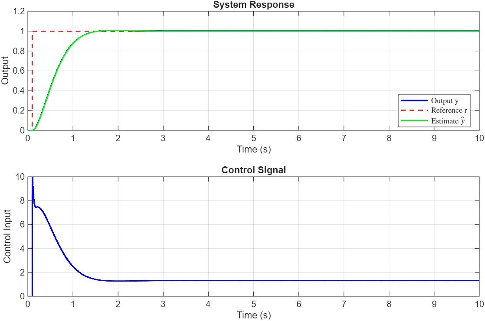
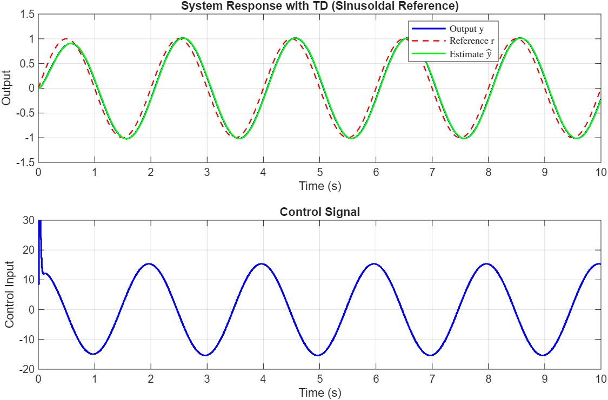
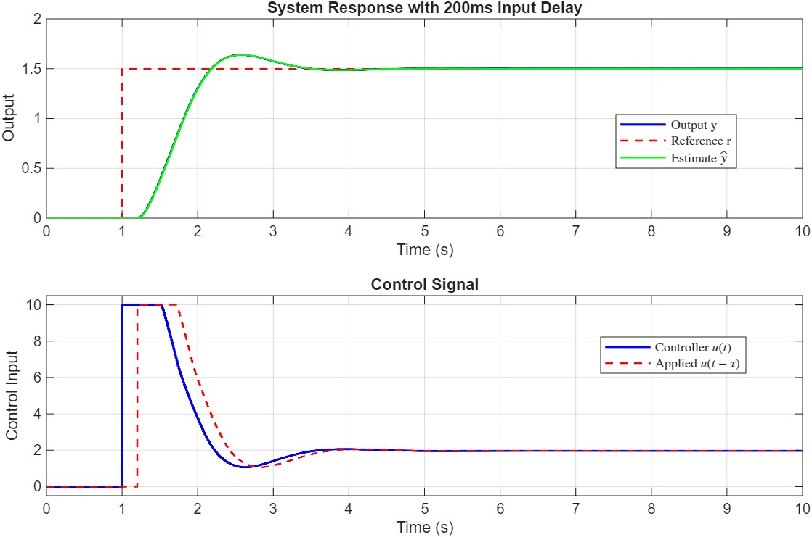
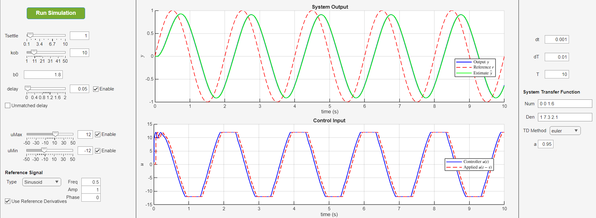

# Active Disturbance Rejection Control (ADRC)

This repository contains Python, C++, MATLAB, and Simulink implementation of Active Disturbance Rejection Control with Extended State Observer (ESO), Tracking Differentiator (TD), input delay compensation, control saturation, and support for optional use of the cascaded structure.

I've summarized a comprehensive note on the theoretical background of _actve disturbance rejection controller_ and _tracking differentiators_. You can find it in [here](/docs/theory.md) (I'll add the cascaded ADRC documentation as soon as possible).

__Note__: Important notes for the Python, C++, Matlab, and Simulink implementations are given after the introduction!

__New__: _Cascaded ADRC_ is now supported for all the environments as well.
 
---
# Demo

Here are some figures showing the controller in action, in presence of time-varying referece signal, input delay, input saturation, etc.









---
Please pay attention to the following:

# Python
__Note__: Good news! You can install the Python implementation using
``` bash
pip install adrc
```
You can look at [the project page on Pypi](https://pypi.org/project/adrc/) for more information.

[](https://pypi.org/project/adrc/)

_Disclaimer_: This badge is provided by shields.io. Source analytics dashboard: [clickhouse-analytics.metabaseapp.com](https://clickhouse-analytics.metabaseapp.com/public/dashboard/8d516106-3a9f-4674-aafc-aa39d6380ee2?project_name=adrc#&theme=night).

__Note__: To be able to use all the Python codes, especially the demo script, you need to have the following packages installed:
- numpy
- scipy          (only needed for the demo)
- matplotlib     (only needed for the demo)
- python-control (only needed for the demo)

# Simulink
Discrete controller implementations are available for first and second-order systems in simulink. There is also a continuous-time implementation for second-order systems. Continuous-time first-order systems will be added as well.
Please pay attention to the following:
- The model settings in all cases is set to _variable step_ solver. I do encourage using this option, unless there is a specfic system you are working with and you know what you are doing.
- In discrete-time simulations, it is necessary that you change the sample time not only where you pass it to the controller, but also in the two or three (depending on the system order) delay blocks that are present in the observer block. I am looking into a way to circumvent this, but for now, you have to change them manually.
- I have added support for first-order and second-order _cascaded ADRC_ as well. You can compare their performance against the standard ADRC in the two simulink files.
- The Simulink files are generated using MATLAB 2025b. If you have an older version and need the files, you can contact me to export them for you. I will add automatic support for older versions as well in the future. You can caontact me via email at _mrgilak02@gmail.com_, but I might not be able to respond quickly due to frequent internet shutdowns in Iran :)

# MATLAB
You can take a look at [this file](/docs/matlab_docs.md) to see how the code works. 

**_Note_**: I have tried to use the same names in MATLAB, Python, and C++; however, I still feel it's necessary to add proper documentation for each. This is in the [TODOs](#todos).

1. **Sample Time**: Controller sample time `dT` can differ from simulation time step `dt`. The controller should be called at rate `dT`.
2. **Delay Compensation**: Input delay is specified in seconds and internally converted to discrete steps. Delay buffer maintains control history.
3. **Initialization**: Always call `initialize()` before `step()`. The controller will throw an error if used uninitialized.
4. **TD Integration**: When TD is enabled, it is automatically updated within `step()`. Manual reference derivatives can still be provided via `varargin` to override TD estimates.
5. **State Estimation**: Access estimated states via `getEstimatedStates()` for monitoring or additional processing.

---
# TODOs

 - [ ] add proper documentation for the Python and C++ versions as well
 - [ ] add theoretical background for cascaded ADRC
 - [ ] add a script to compare MATLAB and Simulink's output for any possible differences
 - [ ] add support for multiple generations of older Simulink versions (distant future!)

---
This repo is maintained by [me](https://github.com/MRGilak). Contributions are welcome as well. 
---

## References
1. Han, J. (2009). "From PID to Active Disturbance Rejection Control". IEEE Transactions on Industrial Electronics.
2. Gao, Z. (2006). "Active Disturbance Rejection Control: A Paradigm Shift in Feedback Control System Design". American Control Conference.
3. Herbst, G. (2013). "A Simulative Study on Active Disturbance Rejection Control (ADRC) as a Control Tool for Practitioners". Electronics.
4. Zheng, Q., Gao, Z. (2010). "On Practical Applications of Active Disturbance Rejection Control". Chinese Control Conference.
5. Madoński, R., & Herman, P. (2015). Survey on methods of increasing the efficiency of extended state disturbance observers. ISA transactions, 56, 18-27.
